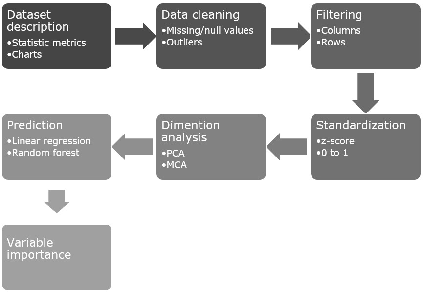
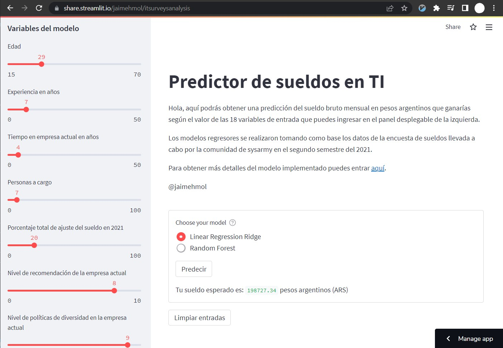
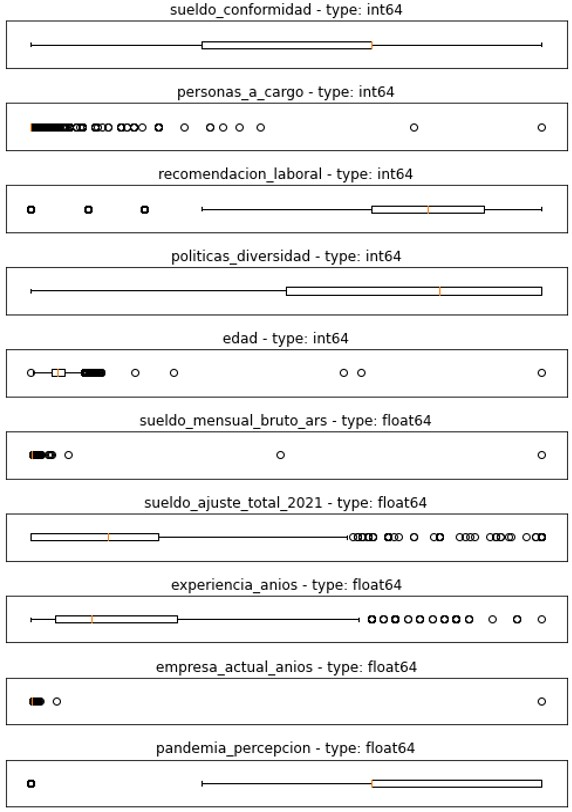
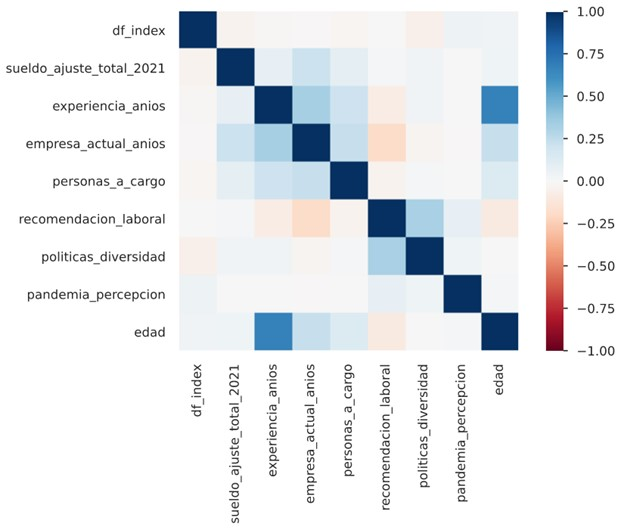
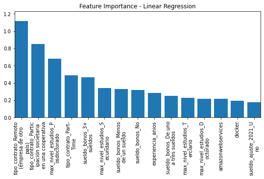
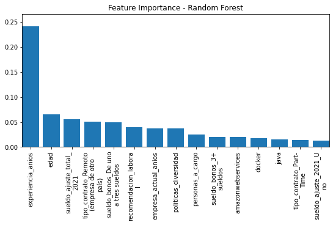

<!-- To build PDF run: pandoc -F pandoc-crossref --pdf-engine xelatex paper.md -o article.pdf --citeproc -->

\maketitle
\thispagestyle{empty}
\clearpage <!-- Also could use \pagebreak -->
\renewcommand{\contentsname}{Tabla de contenido}
\tableofcontents
\pagenumbering{roman}
\clearpage
\pagenumbering{arabic}
\setcounter{page}{1}


**Abstract:**  
El desarrollo de software y las tecnologías de la información es una industria que se hace cada vez más importante en el desarrollo económico y social no solo de los países sino de la humanidad en general, por lo que hacer un análisis cuantitativo apoyado en diversas herramientas que la ciencia de datos nos provee resulta no solo relevante sino también necesario.  Por lo tanto, en el presente estudio se analizan los datos recogidos en una de las encuestas más tradicionales y populares de Argentina, llevada a cabo por la comunidad SysArmy durante el segundo periodo del año 2021, aplicando en ese conjunto de datos técnicas exploratorias (medidas estadísticas de dispersión, centralidad, distribución y outliers), análisis dimensional (correlaciones y componentes principales) y regresiones (Regresión lineal múltiple y random forests) para extraer información que permita perfilar y comprender la evolución del sector poniendo especial foco en el contexto local Argentino.

**keywords**: Desarrollo de software, PCA, Regresión lineal múltiple ridge, random forests, DBScan, IT surveys, Sysarmy.
\pagebreak


# Introducción {#sec:sec1}
El mercado laboral de las tecnologías de la información actualmente tiene una muy alta demanda de profesionales que no está siendo totalmente cubierta debido a múltiples razones, tales como insuficiente cantidad de personas capacitadas, la cada vez más amplia cantidad de tecnologías, frameworks y herramientas de software que requieren conocimiento especializado, la transformación digital que están sufriendo todas las empresas en aras de mantenerse competitivas, entra otras.
Todo lo anterior hace que este se un mercado complejo, apropiado para ser estudiado desde la ciencia de datos. Uno de los más comunes y accesibles conjuntos de datos para trabajar al respecto son las encuestas que se hacen desde las mismas comunidades de TI, que se perfilan como una manera fiable de recolectar datos ya que las personas pertenecientes a estas son también parte del mercado laboral de IT, por lo que se suelen obtener volúmenes significativos de datos que capturan la información relevante para poder analizar, modelar y entender el sector.

A pesar de que este es un caso de estudio bastante específico, existen múltiples estudios que ya lo han abordado, entre los mas relevantes estan [@ref:article1] y [@ref:article2] que llegan a conlusiones que se contrastarán con el caso del mercado Argentino.

El conjunto de datos analizado proviene de la encuesta de sueldos del segundo semestre del 2021 llevada a cabo por Sysarmy. Sysarmy, como ellos se describen en su Linkedin [@ref:web1], nació en el 2012 como una comunidad de administradores de sistemas en la Argentina, pero rápidamente creció a otros países en la región y otras áreas dentro de IT, su lema es "El soporte de quienes dan soporte" y su misión es facilitar el intercambio de conocimiento entre profesionales. La encuesta de sueldo la vienen realizando desde hace 7 años por lo que se ha consolidado y es bastante popular entre los profesionales asociados al área de IT, razones suficientes para elegir esta fuente de datos para ser analizada.

La encuesta posee 66 preguntas con respuestas de tipo continuo (numéricas) y categóricas (que pueden ser categorías fijas, opciones numéricas y respuestas abiertas), recogidas durante 1 mes desde el 1 de Julio de 2021 al 9 de agosto de 2021 y si bien la encuesta está dirigida a todos los países latinoamericanos, es en Argentina donde más respuestas consigue, con un total de 6440 entradas en esta edición, por lo cual el presente estudio se aplica solo al contexto argentino. 

Con este análisis se pretende entender y caracterizar el mercado laboral Argentino en tecnología haciendo especial foco en la detección de características y patrones importantes que influyan en el aumento o disminución del salario mensual que ganan los trabajadores del sector, de tal manera que pueda llegar a ser una herramienta de consulta a la hora de evaluar la situación salarial de los empleados, así como los aspectos en los que debería hacer énfasis para aumentar su percepción económica a la hora de salir a buscar una nueva oportunidad laboral. Desde la perspectiva de las empresas y reclutadores puede ser útil también para comprender las características más importantes del talento que están buscando suplir en sus empresas y que resulta una tarea cada vez más ardua y compleja.

Existen en internet algunos análisis y aplicaciones que han abordado este tema desde distintas perspectivas tales como: [@ref:web7] y [@ref:web8], sin embargo en ninguno de ellos se ha encontrado un estudio centrado en la importancia de las variables que pueden definir el salario de un trabajador en el área de IT por lo que con este trabajo más que reemplazar se busca complementar la información ya existente al respecto.


# Metodología {#sec:sec2}
En primer lugar, se realiza una etapa de limpieza y exploración de los datos, pues a pesar de que existe cierto nivel de calidad en los datos, se busca asegurar que los datos brinden información confiable en la etapa de exploración en la cual calcularemos distintas métricas y visualizaciones estadísticas tales como medidas de dispersión, centralidad, diagramas de cajas, detección y revisión de outliers, independencia y correlación de las diferentes variables medidas. 
Posteriormente, un análisis de componentes principales permitirá analizar la cantidad de información relevante presente en la muestra y una posible reducción de la dimensionalidad de esta será analizada en profundidad.
Finalmente, se realiza un ejercicio de regresión para predecir el salario bruto mensual en pesos argentinos en el rubro de las tecnologías de la información. Para esto se propone implementar una regresión lineal múltiple y un modelo de random forests para así tener dos predictores de características distintas que puedan ser comparados buscando generar respuestas para las siguientes preguntas claves en torno a las cuales gira el análisis que realiza este estudio.

Las preguntas que se busca responder son:

* Desde la perspectiva de un trabajador en el área de tecnología, que salario puede esperar según variables generales tales como nivel de estudio, años de experiencia, edad, ubicación geográfica, tecnologías manejadas, etc.

* Desde la perspectiva de una empresa de búsqueda y contratación de talentos en tecnología, saber cuáles son las áreas y tecnologías con mayor oferta de trabajadores, así como cuál es el salario adecuado en cada una de ellas para cautivar de manera más eficaz a los perfiles adecuados.

* **¿Cuáles son las variables más importantes a la hora de predecir el salario ideal? Variables no relacionadas a las habilidades técnicas en el área, como el género, la edad o la ubicación geográfica afectan los sueldos esperados ¿En qué medida?**


Con los objetivos funcionales claros, a continuación, se presenta un diagrama de flujo a alto nivel del pipeline de procesamiento de datos a implementar, utilizando Python 3.82 y las librerías pandas, pandas_profiling, numpy, mathplotlib y sklearn.

{#fig:figure1}

En el desarrollo de este pipeline de datos se prioriza la reutilización y mantenibilidad del código implementado, para facilmente procesar en el futuro las nuevas versiones (semestralmente) de la encuesta estudiada, así como también otros datasets similares, tales como la encuesta de Stackoverflow y la de Jetbrains, por citar las más famosas. El código fuente implementado es público, abierto y esta alojado en GitHub: [https://github.com/jaimeHMol/ITSurveysAnalysis](https://github.com/jaimeHMol/ITSurveysAnalysis) [@ref:web5].

Finalmente, y apuntando al usuario final que pueda estar interesado en consultar una prediccíon del salario que podría devengar, a modo de referencia según su situación actual, respondiendo las preguntas como parámetros de entrada de los modelos, se provee una aplicación web que puede ser utilizada en el enlace: [IT Salary Prediction in Argentina](https://share.streamlit.io/jaimehmol/itsurveysanalysis), donde como se observa en la [Figura @fig:figure7] las 18 variables de entrada se ingresan en el panel izquierdo para posteriormente, en el panel central seleccionar cual de los modelos regresores se quiere utilizar y calcular la predicción del salario.

{#fig:figure7}


# Análisis exploratorio de los datos (EDA) {#sec:sec3}
La fuente de datos a estudiar corresponde a encuestas realizadas a través de internet, dirigidas a todas las personas involucradas laboralmente en el sector del desarrollo de software y las tecnologías de la información en general. 
**Encuesta de remuneración salarial en Argentina:** Llevada a cabo por Sys Army, una comunidad de administradores de sistemas y desarrolladores de software en general con una larga trayectoria en el sector, que lleva realizando esta encuesta durante los últimos siete años. El conjunto de datos utilizado corresponde a datos recolectados en el último semestre del año 2021 (más exactamente desde el 1 de Julio de 2021 hasta el 9 de agosto de 2021) que están disponibles de manera abierta al público en general [@ref:web4]. Las respuestas se recolectaron usando un "Google form" y la divulgación de la encuesta se hizo principalmente a través de Internet, específicamente Twitter, Discord, foros y portales online.

|  |  |
|:-------------|:--------------|
| **Cantidad de preguntas:** | 48  |
| **Cantidad de respuestas::** | 6095  |
| **Formato del dataset:** | csv  |
| **Peso del dataset:** | 3.70 MB  |
: Descripción archivo con la información cruda de la encuesta {#tbl:table1}

## Caracterización cuantitativa del dataset
Se cargaron los datasets usando un script de Python desarrollado a medida [@ref:web4] para implementar el pipeline de procesamiento de datos. La exploración inicial de la data cruda se realizó utilizando la biblioteca panda_profiler, que calcula todas las métricas estadísticas básicas (dispersión, centralidad, distribución) del dataset y sus columnas y genera un HTML para visualizarlas adecuadamente. A continuación, se resume la información más importante.

| Estadísticas generales del dataset || Typo de variables ||
|:-------------|:--------------|:-------------|:--------------|
| Número de variables | 66  | Categóricas | 46  |
| Número de observaciones | 6440  | Numéricas | 14  |
| Celdas con valores faltantes | 158142  | No soportadas | 6  |
| Celdas con valores faltantes (%) | 37.20  | ||
| Filas duplicadas | 10  | ||
| Filas duplicadas (%) | 0.20  | ||
| Tamaño total en memoria (MB) | 3.20  | ||
| Tamaño promedio en memoria por registro (Bytes) | 528  | ||
: Descripción general del set de datos {#tbl:table2}


\scriptsize
| Variable | Min | Max | Media | Mediana | Desv. Stand. | Val. Faltantes | Val. Distintos | Cant. ceros |
|:---------------------------|:------|:-----------|:------------|:------------|:------------|:------|:--------|:------|
| Salario mensual o retiro NETO (en tu moneda local) | 1 | 40000000 | 167355.60 | 124000 | 548213.60 | 330 | 1539 | 0 |
| ¿De qué % fue el ajuste total? | 0 | 100 | 17.12 | 15 | 16.39 | 0 | 134 | 1861 |
| Años de experiencia | 0 | 42 | 7.79 | 5 | 6.95 | 0 | 54 | 565 |
| Años en la empresa actual | 0 | 2021 | 3.13 | 1 | 25.52 | 0 | 49 | 2382 |
| Años en el puesto actual | 0 | 33 | 2.51 | 1.5 | 3.33 | 0 | 41 | 1949 |
| ¿Gente a cargo? | 0 | 400 | 2.13 | 0 | 10.14 | 0 | 48 | 4793 |
| ¿La recomendás como un buen lugar para trabajar? | 1 | 10 | 7.60 | 8 | 1.89 | 0 | 10 | 0 |
| ¿Cómo calificás las políticas de diversidad e inclusión? | 0 | 10 | 6.797 | 8 | 3.394 | 0 | 11 | 839 |
| Cuánto cobrás por guardia | 0 | 250000 | 794.83 | 0 | 6906.69 | 3422 | 99 | 2803 |
| ¿Tenés hijos/as menores de edad? | 0 | 5 | 0.35 | 0 | 0.70 | 4106 | 5 | 1785 |
| ¿Con cuántas personas estás conviviendo? | 0 | 10 | 1.56 | 1 | 1.29 | 4106 | 9 | 470 |
| Tengo | 11 | 410 | 32.98 | 32 | 9.77 | 0 | 56 | 0 |
: Variables numéricas {#tbl:table3}

\normalsize
| Variable                                                         | Valores Faltantes | Valores Distintos |
|:-----------------------------------------------------------------|:------------------|:------------------|
| Dónde estás trabajando | 0 | 25 |
| Tipo de contrato | 0 | 6 |
| Salario mensual o retiro BRUTO (en tu moneda local) | 1 | 1692 |
| Pagos en dólares | 5061 | 7 |
| ¿Cuál fue el último valor de dólar que tomaron? | 5440 | 249 |
| ¿Qué tan conforme estás con tu sueldo? | 0 | 4 |
| Cómo creés que está tu sueldo con respecto al último semestre | 0 | 4 |
| Recibís algún tipo de bono | 0 | 5 |
| A qué está atado el bono | 1 | 249 |
| ¿Tuviste ajustes por inflación durante 2021? | 0 | 5 |
| ¿En qué mes fue el último ajuste? | 0 | 11 |
| Trabajo de | 0 | 352 |
| Plataformas | 1 | 1531 |
| Frameworks, herramientas y librerías | 1 | 1259 |
| Bases de datos | 1 | 1259 |
| QA / Testing | 7 | 637 |
| IDEs | 2 | 953 |
| Cantidad de personas en tu organización | 0 | 10 |
| Trabajo para una empresa que no tiene oficina en mi ciudad | 5098 | 1 |
| Actividad principal | 0 | 3 |
| ¿La recomendás como un buen lugar para trabajar? |  |  |
| Beneficios extra | 1 | 1982 |
| ¿Salir o seguir contestando? | 0 | 2 |
| Nivel de estudios alcanzado | 3156 | 7 |
| Estado | 3156 | 3 |
| Carrera | 3318 | 408 |
| Universidad | 3399 | 482 |
| Realizaste cursos de especialización | 3156 | 6 |
| ¿Contribuís a proyectos open source? | 3156 | 2 |
| ¿Programás como hobbie? | 3156 | 2 |
| ¿Salir o seguir contestando?_1 | 3156 | 2 |
| ¿Tenés guardias? | 3422 | 3 |
| ¿Porcentaje, bruto o neto? | 3422 | 3 |
| ¿Salir o seguir contestando?_2 | 3422 | 2 |
| ¿Sufriste o presenciaste situaciones de violencia laboral? | 3661 | 3 |
| ¿Tenés algún tipo de discapacidad? | 6189 | 49 |
| ¿Sentís que esto te dificultó el conseguir trabajo? | 5564 | 2 |
| ¿Salir o seguir contestando?_3 | 3634 | 2 |
| ¿Cómo venís llevando la pandemia? | 4106 | 4 |
| ¿Con quiénes convivís? | 4106 | 77 |
| ¿Tenés un espacio dedicado para el trabajo? | 4106 | 2 |
| ¿Tenés que compartir tu equipo de trabajo con alguien? | 4106 | 2 |
| ¿Qué tipo de cuarentena hiciste / estás haciendo? | 4106 | 4 |
| ¿Cambió tu situación laboral a raíz de la pandemia? | 4106 | 137 |
| ¿Qué tanto sentís que te está apoyando tu empresa/organización en esta situación? | 4106 | 10 |
| ¿Cómo se vio afectada tu empresa/organización? | 4107 | 227 |
| ¿Instauraron algún beneficio nuevo? | 4106 | 285 |
| Me identifico | 1 | 146 |
| Unnamed: 60 | 6440 | 1 |
| Unnamed: 61 | 6440 | 1 |
| Unnamed: 62 | 6440 | 1 |
| Unnamed: 63 | 6440 | 1 |
| Unnamed: 64 | 6440 | 1 |
| Unnamed: 65 | 6440 | 1 |
: Variables categóricas {#tbl:table4}

Como se puede observar hay varias tareas de preprocesado básico muy importantes, tales como 

* La corrección del tipo de dato automáticamente cargado por la librería (Pandas) cuando leyó el CSV con los datos, pues podemos ver como las columnas **Salario mensual o retiro BRUTO (en tu moneda local)**, **Cantidad de personas en tu organización** y **¿Cuál fue el último valor de dólar que tomaron?** son claramente variables numéricas continuas y no categóricas. 

* El renombrado de las columnas, para tener nombres más cortos, fáciles de entender, evitando caracteres especiales como espacios o signos de interrogación, convirtiendo nombres como **¿Sufriste o presenciaste situaciones de violencia laboral?** en **violencia_laboral**, o **Me identifico** en **genero** por poner solo algunos ejemplos. El mapeo completo puede ser consultado en archivo _mappings.py_ de la solución desarrollada [@ref:web4].

* La eliminación de columnas irrelevantes desde las perspectiva con la que estamos abordando el problema, como por ejemplo **¿Salir o seguir contestando?**, **¿Qué tan conforme estás con tu sueldo?**, **ID** o **Unnamed: 60**. 

Luego de tener el dataset en un mejor estado, se procede a analizar más en profundidad las variables numéricas, pues se sospecha que la existencia de outliers y valores faltantes puede ser un problema para el análisis posterior.

## Manejo de outliers y valores faltantes
Los box-plot de la [Figura @fig:figure2] sugieren la existencia de valores atípicos en la muestra tanto para el extremo inferior como para el extremo superior, por lo que a continuación analizaremos individualmente algunos de los casos más interesantes, pues no es recomendable descartarlos sin siquiera examinar su origen y el potencial informativo que estos pueden aportar al presente estudio.

{#fig:figure2}

Dado que no se tiene un número de muestras demasiado grande no se quiere descartar filas por tener alguna de sus columnas con valores extremos o faltantes. Por lo cual se analiza columna a columna los valores faltantes o erróneos, donde las variables categóricas son las más problemáticas debido a que en la mayoría de las preguntas de la encuesta no se limitó adecuadamente las categorías permitidas en cada caso. La columna **género** es un perfecto ejemplo donde se evidencia que las personas han respondido de diversas maneras para referirse a un mismo género, mientras que otras simplemente han preferido no responder. Por lo cual se transformaron todas las respuestas para entrar en solo cuatro opciones: femenino, masculino, otro y prefiero no responder. Este mismo proceso se realizó con el resto de respuestas a preguntas abiertas que no tenían un número fijo de opciones.

En cuanto al manejo de valores extremos se realizó la eliminación de la fila completa cuando los valores estaban más allá del rango inter-cuartil, por debajo del cuantil 5% o por encima del cuantil 95% según el caso. Por ejemplo, la variable sueldo presenta valores detectados en el box-plot como extremos pero que en la realidad no lo son, pues son los sueldos de algunas personas que por su cargo y experiencia realmente ganan una cantidad de dinero que esta varios ordenes de magnitud por encima de la media. Así mismo cuando los valores del **sueldo mensual bruto expresado en pesos argentinos** (ARS) fue menor a 10000 se consideró un error en las respuestas dadas por los encuestados, asumiendo que en realidad no tuvieron en cuenta el enunciado completo de la pregunta e ingresaron el valor en dólares (USD), por lo que para estos casos se hizo la imputación utilizando la tasa de cambio correspondiente a la fecha en que se respondió la encuesta. 
En otros casos como en la variable **edad**, los valores extremos detectados utilizando como base el rango inter-cuartil (básicamente edades menores a 18 y mayores a 80 años) produjeron la eliminación de la fila completa dado que eran muy pocos los casos y no se tenía ninguna manera medianamente confiable para imputar estos valores.

## Transformaciones
Ahora con el dataset libre de outliers, valores faltantes y alta cardinalidad se efectuaron algunas transformaciones sobre los datos en sí, con el objetivo de que sean más adecuados para los modelos de regresión que se aplicaran posteriormente. 
En el presente trabajo se realizan dos transformaciones que tienen un gran impacto especialmente en el análisis de componentes principales y las regresiones lineales, sin  embargo, vale la pena aclarar que el proceso de exploración de datos (EDA por sus siglas en ingles) es iterativo y debe ser revisitado cada vez que se ajusten nuevos modelos, nuevos datos o nuevas transformaciones.

### Escalado de variables continuas
Dado que las variables numéricas pueden tener diferentes unidades según la pregunta de la encuesta a la que correspondan, por ejemplo, años, pesos, dolares, etc se realiza una standarización o escalado de los valores de estas variables. Con esto se evitan posibles impactos negativos en algunos modelos y algoritmos de analisis de datos que son sensibles a la magnitud de los valores.

Existen múltiples maneras de escalar las variables continuas, por ejemplo, se puede realizar una normalización estándar, que resta la media muestral y luego la divide en la desviación estándar a cada valor de la muestra, o se puede utilizar un escalado en el que se aplica la función de escala de valores mínimos y máximos a cada columna. 

En el presente estudio se realizó la estandarización utilizando la clase StandardScaler de la librería scikit learn, que se le aplica a todas las 7 variables numericas que tiene el dataset así como la variable que se busca predecir, teniendo en cuenta que las predicciones realizadas (con cualquier modelo que utilice las variables transformadas) se les deberá aplicar la transformación inversa para obtener los valores ajustados a sus unidades originales.


### Tokenización de variables categóricas
TODO: WIP
Muchos modelos predictores y regresores de machine learning son sensibles a la cardinalidad de los datos cuando hablamos de variables categóricas, en algunos de ellos ni siquiera es posible utilizar este tipo de variables, por lo que se realiza una tokenización de las variables categóricas presente en el dataset analizado. La transformación implementada consiste en crear una variable numérica que puede tomar unicamente los valores de 0 o 1 por cada una de las categorías existentes en cada una de las variables categoricas, de esta manera todas las variables de entrada serán númericas, aunque con la desventaja que nuestro modelo ahora receibirá una mayor cantidad de variables, aumentando la complejidad y el tiempo de entrenamiento del mismo.


## Análisis de dimensionalidad de los datasets
Luego de tener un entendimiento base de los datasets estudiados, el siguiente paso es realizar un análisis de componentes principales, comúnmente abreviado como PCA (por sus siglas en inglés), buscando conocer las implicaciones de una reducción de la dimensionalidad, que se observa necesaria pues el conjunto de datos original tiene una gran cantidad de atributos (64 preguntas en total) que no se quieren descartar arbitrariamente. Esta técnica aplica solo para variables numéricas, que luego del pre-proceso explicado en secciones previas terminaron siendo un total de 7:

* edad
* experiencia_anios
* empresa_actual_anios
* personas_a_cargo
* sueldo_ajuste_total_2021
* recomendacion_laboral
* politicas_diversidad
<!-- * pandemia_percepcion -->

Nótese que la variable que se buscará predecir no fue incluida en la lista.
El proceso de PCA es una técnica exploratoria que no establece supuestos y siempre peude utilizarse para identificar las direcciones con mayor varianza con las cuales se puede transformar un nuevo espacio vectorial. Como la varianza de una variable se mide en sus mismas unidades elevadas al cuadrado, si antes de calcular las componentes no se estandarizan todas las variables para que tengan media cero y desviación estándar de uno, aquellas variables cuya escala sea mayor dominarán al resto. Por lo que antes de realizar el llamado de la función que ejecuta el cálculo de PCA se realizó la estandarización de las mencionadas variables [@ref:web2], tal y como se mostró previametne en el apartado de transformaciones.

Así mismo, el análisis de componentes principales es muy sensible a valores atípicos, de ahí surge la razón por la que en este estudio realizamos primero el manejo de outliers y valores faltantes antes que el análisis de la dimensionalidad.

Los resultados del porcentaje total de variabilidad explicada luego de calcular la segunda, tercera, cuarta y quinta componente principal se observa en la [Tabla @tbl:table5]. 

# TODO: Ajustar esto!!!!
| Cantidad de componentes principales | Variabilidad total explicada |
|:-------------|:--------------|
| 2 | 90.8921 %  |
| 3 | 94.6825 %  |
| 4 | 97.9410 %  |
| 5 | 98.8467 %  |
: El total de variables numéricas utilizadas en el análisis de componentes principales es 8 {#tbl:table5}

Con solo dos componentes principales se explica una significativa variabilidad de los atributos numéricos, por lo que para el procesamiento posterior se utilizaran estas dos componentes buscando disminuir la complejidad de los modelos.

Una vez reducida la dimensionalidad de las variables numéricas se hace importante analizar también la dimensionalidad de las variables categóricas pues es aquí donde está el grueso de variables del dataset. Para ello se ejecuta un análisis de correspondencia múltiple (MCA por sus siglas en inglés), que se define como una técnica multivariante que permite representar conjuntamente las categorías de las filas y columnas de una tabla de contingencia. Constituye el equivalente de análisis de componentes principales para variables cualitativas y no requiere el cumplimiento de ningún supuesto para poder aplicarla. Más específicamente, busca una representación en coordenadas de las filas y columnas de una tabla de contingencia, de modo tal que los patrones de asociación presentes en la tabla se reflejen en dichas coordenadas. Teniendo en cuenta que una tabla de contingencia es un arreglo matricial de números positivos donde en cada casilla se presenta la frecuencia absoluta observada para esa combinación de variables. [@ref:book2]

Tomando como entrada para el MCA las 11 variables categóricas que se listan a continuación:

* tipo_contrato
* sueldo_bonos
* sueldo_ajuste_2021
* max_nivel_estudios
* max_nivel_estudios_estado
* cursos_especializacion
* contribucion_open_source
* programacion_hobbie
* guardias
* violencia_laboral
* genero

Los resultados de porcentaje total de variabilidad explicada (suma de las inercias de todas las dimensiones resultante) luego de calcular 2, 3 4 y 5 dimensiones se observan en la [Tabla @tbl:table6]. 


| Cantidad de componentes principales | Variabilidad total explicada |
|:-------------|:--------------|
| 2 | 20.0691 %  |
| 3 | 23.9006 %  |
| 4 | 27.6035 %  |
| 5 | 30.9162 %  |
: El total de variables categóricas utilizadas en el análisis correspondencia múltiple es 11 {#tbl:table6}


Debido a la alta correlación existente entre numerosas variables del dataset, que se puede observar en el mapa de calor de la [Figura @fig:figure3], obtenemos una reducción de dimensionalidad muy efectiva en el caso de las variables numéricas continuas, pues a grandes rasgos con solo dos dimensiones se llega a cubrir el 90% de la variabilidad del dataset. 

Resulta interesante entonces tener en cuenta las nuevas dimensiones encontradas para los modelos de predictores que se implementan en próximos capítulos, a pesar de que perdemos explicabilidad del modelo, al ser estas variables generadas artificialmente buscando únicamente aumentar la varianza de los datos sobre cada eje, podemos aumentar la efectividad predictora de los modelos al reducir la correlación y colinealidad entre las variables de entrada utilizadas en el modelado. 


{#fig:figure3}


# Predicción de salarios {#sec:sec4}
## Predicción del salario mensual
Buscando responder uno de los objetivos de este estudio, se entrenan y ajustan dos modelos para predecir el salario mensual en pesos argentinos (ARS) que es una variable numérica continua por lo que nos encontramos ante un problema de regresión. Dadas las características del conjunto de datos y buscando contrastar dos aproximaciones diferentes para abordar la regresión, se ajustará un modelo proveniente de la estadística como lo es la regresión lineal múltiple y un modelo de árboles aleatorios (random forests) del área de las ciencias de la computación.

En ambos casos se aplicó validación cruzada entrenando 25 modelos para cada uno dividiendo aleatoriamente el conjunto de datos en 70% de las filas para entrenamiento y el 30% restante para el set de pruebas, para posteriormente calcular el promedio de las metricas de evaluación utilizadas tales como el R2 y el MSE, buscando de esta manera trabajar con las características estables de cada modelo.


### Regresión lineal múltiple
La regresión lineal es el método de "aprendizaje de máquina" más representativo para construir modelos para la predicción y clasificación de valores a partir de datos de entrenamiento. Su estudio ofrece varios contrastes:


* La regresión lineal tiene una hermosa base teórica pero, en la práctica, esta formulación algebraica generalmente se descarta en favor de optimizaciones más heurísticas y más rápidas.


* Los modelos de regresión lineal son, por definición, lineales. Esto proporciona una oportunidad de presenciar las limitaciones de tales modelos, así como desarrollar técnicas inteligentes para generalizar a otras formas.


* La regresión lineal al mismo tiempo fomenta la construcción de modelos con cientos de variables, y técnicas de regularización para asegurar que la mayoría de ellas sean ignoradas.


La regresión lineal es una técnica de modelado básica que debería servir como una aproximación base para crear modelos basados ​​en datos. Estos modelos son típicamente fáciles de construir, sencillos de interpretar y, a menudo, funcionan bastante bien en la práctica. Con suficiente habilidad y esfuerzo, técnicas de aprendizaje automático más avanzadas podrían producir un mejor rendimiento, pero la posible recompensa a menudo no vale la pena el esfuerzo. Construya sus modelos de regresión lineal primero, luego decida si vale la pena trabajar más duro para lograr mejores resultados. [@ref:book4]


# TODO: Ajustar esto al nuevo modelo implementado.
Siguiendo la recomendación de Steven, autor de la introducción citada en esta sección, se aborda el problema de regresión planteado comenzando con el modelo base por excelencia, una regresión lineal múltiple clásica con todas las variables numéricas disponibles en el set de datos resultante de la etapa de preprocesado (recordando que las variables categóricas fueron transformadas a numéricas al tokenizar cada una de las categorías de cada variable), obteniendo un coeficiente R2 de 0.3988 lo que sugiere que no se está logrando representar toda la variabilidad de la variable predicha. Esto puede deberse a que el modelo tiene demasiada complejidad (muchas variables), que nuestra muestra de datos (cantidad de filas) no es lo suficientemente representativa como para modelar el problema, o que no se esten compliendo los supuestos de la regrasión lineal que son:

* Las variables de entrada deben tener distribución normal.
* Las variables de entrada deben tener la misma varianza (homocedasticidad).
* La variables de entrada no deben presentar colinealidad entre ellas.

Finalmente, buscando mejorar el desempeño de la regresión lineal, también se puede considerar agregar una componente de regularización usando técnicas como Lasso o Ridge, tal que el modelo pueda minimizar el riesgo de overfitting, reducir la varianza y el efecto de la correlación entre las variables de entrada especialmente de aquellas variables menos relevantes.


<!-- verificar si esto se va a hacer (yo digo que no): por lo que se agrega una componente de regularización usando Ridge (o Lasso) que mejora el desempeño del modelo aumentado a XXX% la variabilidad cubierta.
Posteriormente, y dado no estar consiguiendo una mejora significativa en la capacidad predictiva del modelo se decide comprobar los supuestos bajo los cuales se construye la regresión lineal múltiple:

 Detalles finales de la implementación. -->


### Random Forests
Un bosque aleatorio (mejor conocido en ingles como random forest) es esencialmente una colección de árboles de decisión, donde cada árbol es ligeramente diferente de los demás. La idea detrás de los bosques aleatorios es que cada árbol puede hacer un trabajo relatiavemente bueno de predicción, pero es probable que se sobreajuste a una parte de los datos. Si se construyen muchos árboles, los cuales funcionan bien y se sobreajustan  de diferentes maneras, podemos reducir la cantidad de sobreajuste promediando sus resultados. Esta reducción en el sobreajuste, mientras se conserva el poder predictivo de los árboles, se puede demostrar usando matemáticas rigurosas.
Para implementar esta estrategia, se requiere construir muchos árboles de decisión. Cada árbol debe hacer un trabajo aceptable de predecir el objetivo, y también debe ser diferente de los demás árboles. Los bosques aleatorios obtienen su nombre de la inyección de aleatoriedad en la construcción de los árboles para asegurar que cada árbol es diferente. Hay dos formas en que los árboles son aleatorizados en un bosque aleatorio: seleccionando los puntos de datos utilizados para construir un árbol y seleccionando las características (variables) en cada división. [@ref:book3]

Este modelo puede ser utilizado tanto para problemas de clasificación así como de regresión. Suele funcionar bastante bien con variables a predecir con comportamiento no lineal, sin embargo al incluir aleatoriedad y una gran cantidad de predictores (árboles de decisión) ensamblados la interpretabilidad del modelo no es la mejor.

Este modelo tiene muchos parámetros que se pueden ajustar, sin embargo los más relevantes son la _cantidad de árboles a construir_, que a mayor sea mejores resultados de predicción se obtendrán, sin embargo,  impactará también en el procesamiento total requerido en el entranamiento (más tiempo de computo entrenando el modelo), así como la _cantidad de variables_ (max features) a utilizar en cada árbol, empiricamente se conoce que un buen número de partida es log2(n_features) donde n_features es el total de variables del dataset, y la _cantidad de muestras_ (filas) a utilizar para generar cada arbol. Los últimos dos parámetros son los que a la postre definen el nivel de azar que se maneja al construir el bosque aleatorio.

Con un R2 de 0.3561 se evidencia que no se está captando toda la variablidad de los datos por lo que un ajuste de los parámetros propios del modelo (externos a la data en sí) podría mejorar el desempeño.  Este proceso se conoce como optimización de hiperparámetros y es es una de las actividades propuestas como trabajo futuro para mejorar la performance de los modelos implementados.


## Comparación de los modelos
Para evaluar el rendimiento de un método de aprendizaje estadístico en un conjunto de datos dado, necesitamos alguna forma de medir qué tan bien sus predicciones coinciden realmente con los datos observados. Es decir, necesitamos cuantificar hasta qué punto el valor de respuesta pronosticado para una observación determinada se acerca al valor de respuesta real para esa observación. En problemas de regresión, la medida más utilizada es el error cuadrático medio (MSE), dado por la [Fórmula @eq:eq1] donde f(xi) es la predicción que da f para la i-ésima observación e yi es el valor real.


$$ M S E =  \frac{1}{n} \sum_{i=1}^{n} (y_{i} - \hat{f}(x_{i}))^2 $$ {#eq:eq1}

El MSE será pequeño si las respuestas pronosticadas están muy cerca de las respuestas verdaderas, y será grande si para algunas de las observaciones, las respuestas pronosticadas y verdaderas difieren sustancialmente. [@ref:book1]

Se utilizará entonce el MSE para comparar los dos modelos regresores implementados anteriormente, haciendo énfasis que este se calcula utilizando el subconjuto de datos de test para cada modelo a comparar. El MSE obtenido a partir de los datos de training no tiene ningún significado real ya que su minimización llevará al overfiting de los modelos alejandonos de una predicción precisa para observaciones nuevas (que el modelo no haya visto antes). Los resultados obtenidos se pueden observar en la [Tabla @tbl:table7].

| Modelo | Número de predictores | MSE |
|:-------------|:--------------|
| Regresión lineal múltiple ridge | 66 |  0.6385  |
| Random Forest | 66 | 0.6843  |
: Comparativa del rendimientode los dos modelos regresores utilizados {#tbl:table7}

TODO: Usar esta referencia [@ref:book5] y finalizar comparación.


## Importancia de los features (feature engineering):
A continuación, se compara la importancia de las variables también conocidas como features calculada en cada uno de los dos modelos implementados,  para cuantificar que tanto contribuyen las variables medidas en encuesta procesada, tal que nos provea argumentos sólidos para por ejemplo recomendar cuales son los aspectos más importantes que un trabajador en el mercado del desarrollo de software debe tener en cuenta dentro del contexto económico argentino.

En el caso de la regresión lineal, la importancia de las variables esta determinada por el coeficiente que acompaña a cada variable en la ecuación resultante del modelo, de nuevo reafirmando la importancia de previamente haber escalado/estandarizado las variables númericos del dataset. Notese que el impacto de cada variable de entrada en la variable a predecir es relevante sin importar el signo positivo o negativo que el coeficiente tenga, por lo que es el valor absoluto de los coeficientes el que determina la importancia de cada variable. 

En la [Figura @fig:figure4] se observa la importancia de las 15 variables más relevantes de la regresión lineal, teniendo en cuenta que las variables categóricas fueron tokenizadas y que las variables numéricas fueron escaladas/estandarizadas tal y como se explicó en [@sec:sec3].

{#fig:figure4}

En cuanto al modelo de random forest, al tratarse de una combinación de múltiples árboles, no es posible obtener una representación gráfica sencilla del modelo y no es inmediato identificar de forma visual que predictores son más importantes. Sin embargo, se han desarrollado nuevas estrategias para cuantificar la importancia de los predictores que hacen de los modelos de bagging (Random Forest) una herramienta muy potente, no solo para predecir, sino también para el análisis exploratorio. Dos de estas medidas son: importancia por permutación e impureza de nodos. [@ref:web6]
En general, estos métodos buscan medir la cantidad de información aportada por cada variable cuando es utilizada en la creación de los árboles de decisión que componen el random forest.

En la [Figura @fig:figure5] se presenta la importancia del top 15 de las variables según el modelo de random forest entrenado, obtenidos directamente de la implementación realizada por la librearía Scikit Learn. 

{#fig:figure5}

Si bien es cierto que la importancia de los variables varía según el modelo implementado, existen 6 que coinciden en dentro del top 15 de mayor relevancia en ambos modelos:
* tipo_contrato_Remoto (empresa de otro país)
* sueldo_bonos_3+ sueldos
* sueldo_bonos_De uno a tres sueldos
* amazonwebservices
* docker

En general las variables relacionadas a las condiciones de contratación como el tipo contrato o la cantidad de bonos a recibir son las que más aportan a la predicción de la salario en ambos modelos, mientras que las variables asociadas a la información personal y académica del candidato hacen parte de las que menos aportan, sugiriendo que no existe discriminación o brecha salarial asociada a tales variables, haciendo la salvedad, que algunas de estas están desbalanceadas lo que puede estar impactando la perfomance general de los modelos y por ende también la importancia calculada de las variables.


# Conclusiones {#sec:sec5}
* Tener la variable de interés (dependiente) que se quiere analizar/predecir dentro del análisis de reducción de dimensiones puede llevar a resultados donde esta sea la que en mayor medida explique la variabilidad total del conjunto de datos, produciendo resultados en los cuales solo la primera componente tiene más del 90% de la variabilidad total. Esto nos puede llevar a conclusiones triviales y erradas que se deben evitar. Un gráfico biplot (para el caso de dos componentes) en este escenario mostrará claramente la variable que está explicando la mayor variabilidad y que debería ser removida en caso de ser la variable a predecir.
 
* Como era de esperarse las actividades de preprocesamiento fueron las que más tiempo requirieron (tomando un 84% del tiempo total utilizado en este estudio) debido a múltiples razones, entre las más importantes están que las respuestas a varias preguntas no fueron adecuadamente restringidas desde el mismo diseño de la encuesta, así como numerosas preguntas que no fueron respondidas, produciendo valores perdidos, que en principio no se quisieron descartar pues la cantidad de observaciones tampoco era muy grande. (Comentarios sobre los resultados obtenidos en la limpieza y exploración inicial de los conjuntos de datos).

TODO: * (Conclusiones sobre la dimensionalidad de los conjuntos de datos, específicamente sobre las variables que parecen ser más relevantes, describiendo la mayor cantidad de la variabilidad en los datos).

* El modelo de random forest presentó resultados marginalmente superiores que la regresión lineal múltiple, posiblemente debido a que está última no tenía ningún tipo de regularización. Como trabajo futuro podría implementarse y analizar una regresión Ridge y Lasso para confirmar que efectivamente el MSE (coeficiente utilizado para comparar los modelos) aumenta. (Conclusiones sobre el funcionamiento de los dos modelos utilizados.)

TODO: * (Conclusiones del desempeño de los modelos utilizados utilizando la dimensionalidad reducida, los valores estandarizados, la imputación de los valores perdidos y quizá también omitiendo el ajuste de outliers).

* Los resultados obtenidos en los análisis de reducción de dimensionalidad y de importancia de las variables en cada uno de los modelos implementado nos evidencian que las variables externas al trabajo en IT no tienen la influencia que mediáticamente se supone. Variables como el género, la localización, cantidad de hijos, etc no son las que más aportan en la predicción del salario mensual, mientras que los años de experiencia, las personas a cargo y algunas tecnologías son las que predominan en ambos modelos. Los modelos fueron entrenados excluyendo las variables género y localización, para posteriormente confirmar el mínimo impacto en la capacidad predictora de los modelos, utilizando para ello el RMSE como índice de comparación. (Conclusiones sobre el mercado laboral en desarrollo de software y tecnologías de la información en Argentina).

* Siguiendo la línea propuesta por [@ref:article3], se evidencia que la encuesta analizada es suceptible a las falencias comunes en este tipo sondeos. Especialmente el no tener estandarizadas las diferentes posiciones o grados existentes en la industria IT impacta en la comparabilidad de los resultados. Lo que justifica también que los resultados de los modelos regresores implementados no sean especialmente sobresalientes. Basicamente la data tiene problemas que provenien directamente desde la construcción de la encuesta. Sin mencionar que las variables económicas, sociales y políticas del país, la muestra conseguida y el diseño de varias de las preguntas son factores que también afectan el presente estudio.


# Trabajo futuro {#sec:sec6}
El presente trabajo es solo el preambulo de todo lo que se puede explorar y analizar respecto a la predicción de sueldos. En general existen dos grandes apartados en los que se puede seguir trabajando en el futuro.

1. El código implementado es suceptible a muchas mejoras, especialmente desde el punto de la ingeniería de software, que se hace relevante en el momento en que modelos como los que aquí se implementaron sean llevados a ambientes de producción, donde el rendimiento y la mantenibilidad del código es fundamental.

2. Existe una innumerable cantidad de modelos y técnicas estadísticas y de aprendizaje de máquina que podrían probarse y compararse buscando mejores resultados predictivos. Así mismo, incluir los datos recolectados de esta misma encuesta durante los últimos 7 años permitiría también realizar análisis de series temporales buscando encontrar patrones y conocimiento más profundo y valioso sobre estes tema.

3. Existen más encuestas sobre el tema tratado en este estudio que podrían analizarse para comparar por ejemplo el mercado IT argentino con el mergado IT global, buscando responder preguntas y verificar hipótesis más allá del alcance del presente trabajo.
(Mejoras en el código).
(Construcción de un modelo predictivo que además pudiera ser utilizado de manera online).
(Enriquecimiento de los datasets con datos económicos).


# Bibliografía
*  Papers como: https://www.researchgate.net/publication/289469100_Teachers_salary_data_analysis_using_data_mining_techniques

* https://towardsdatascience.com/a-simple-guide-to-beautiful-visualizations-in-python-f564e6b9d392
* https://towardsdatascience.com/a-straightforward-guide-to-cleaning-and-preparing-data-in-python-8c82f209ae33 
(* https://www.youtube.com/watch?v=1uhPYIsJD3s)


# Referencias


<!-- This is a demo file for pandoc-crossref. With this filter, you can cross-reference figures (see [@fig:figure1;@fig:figure2;@fig:figure3]), display equations (see @eq:eqn1), tables (see [@tbl:table1]) and sections ([@sec:sec1; @sec:sec2; @sec:caption-attr; @sec:table-capts; @sec:wrapping-div])

For immediate example, see @fig:figure0

{#fig:figure0}

There is also support for code blocks, for example, [@lst:captionAttr; @lst:tableCaption; @lst:wrappingDiv]

It's possible to capitalize reference prefixes, like this: [@Fig:figure1].

In case of multiple references, capitalization is determined by first reference. [@Fig:figure1; @fig:figure2] is capitalized, while [@fig:figure2; @Fig:figure1] is not.

It is also possible to mix different references, like [@fig:figure1; @tbl:table1; @lst:captionAttr; @lst:tableCaption; @fig:figure2; @fig:figure3], which will be grouped in order they are specified. You can even intermix this with regular citations, although it's not recommended: [@fig:figure1; @tbl:table1; @unprocessedCitation]

You can also have custom chapter reference labels, like @sec:custlabs

Subfigures are supported, see [@fig:subfigures; @fig:subfigureB]

# Chapter 1. Figures {#sec:sec1}

{#fig:figure1}

{#fig:figure2}

{#fig:figure3}


<div id="fig:subfigures">


{#fig:subfigureB}

Subfigures caption
</div>

# Chapter 2. Equations {#sec:sec2}

Display equations are labelled and numbered

$$ P_i(x) = \sum_i a_i x^i $$ {#eq:eqn1}

Since 0.1.6.0 those can also appear in the middle of paragraph
$$a x^2 + b x^2 + c = 0$${#eq:quadr} like this.

# Chapter 3. Tables

| First Header | Second Header |
|:-------------|:--------------|
| Content Cell | Content Cell  |
| Content Cell | Content Cell  |

: Table example {#tbl:table1}

Table without caption:

| First Header | Second Header |
|:-------------|:--------------|
| Content Cell | Content Cell  |
| Content Cell | Content Cell  |

# Chapter 4. Code blocks

There are a couple options for code block labels. Those work only if code block id starts with `lst:`, e.g. `{#lst:label}`

## `caption` attribute {#sec:caption-attr}

`caption` attribute will be treated as code block caption. If code block has both id and `caption` attributes, it will be treated as numbered code block.

```{#lst:captionAttr .haskell caption="Listing caption"}
main :: IO ()
main = putStrLn "Hello World!"
```

\pagebreak

## Table-style captions  {#sec:table-capts}

Enabled with `codeBlockCaptions` metadata option. If code block is immediately
adjacent to paragraph, starting with `Listing: ` or `: `, said paragraph will be
treated as code block caption.

Listing: Listing caption

```{#lst:tableCaption .haskell}
main :: IO ()
main = putStrLn "Hello World!"
```

## Wrapping div

Wrapping code block without label in a div with id `lst:...` and class, starting with `listing`, and adding paragraph before code block, but inside div, will treat said paragraph as code block caption.

<div id="lst:wrappingDiv" class="listing">
Listing caption
```{.haskell}
main :: IO ()
main = putStrLn "Hello World!"
```
</div>

# Unnumbered chapter. {-}

This chapter doesn't change chapter prefix of referenced elements, instead keeping number of previous chapter, e.g.
$$ S(x) = \int_{x_1}^{x_2} a x+b \  \mathrm{d}x $$ {#eq:eqn2}

# Chapter 5. Reference lists

It's also possible to show lists of figures and tables, like this:

\listoffigures

\listoftables

\listoflistings

# Appendix A. Custom labels {label=AppA}

## This section will have custom label {#sec:custlabs label=CustLab} -->
